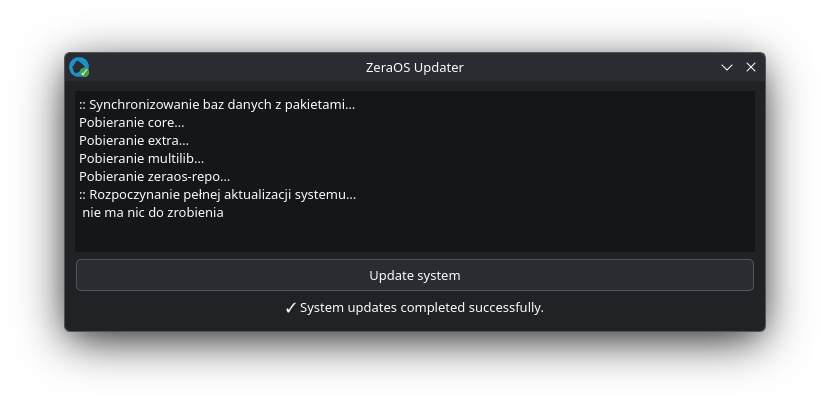

# ZeraOS-Updater
<p align="center">
  
  
> [!NOTE]
> A simple [ZeraOS](https://github.com/Dark8292/ZeraOS) system updater. It works on Arch-based systems and pure Arch Linux.

## Install in Arch Linux

### 1. Clone a repository

```bash
git clone https://github.com/Dark8292/ZeraOS-Updater.git
```

### 2. Entering the repository

```bash
cd ZeraOS-Updater
```
### 3. Compiling

```bash
makepkg
```

### 4. Installing 

```bash
sudo pacman -U zeraos-updater*.pkg.tar.zst
```
